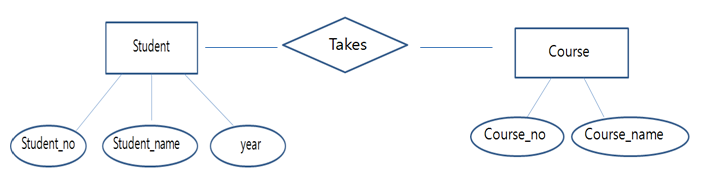

# Entity Relationship Model

## Entity Relationship Model - E-R 모델

논리적 데이터 모델의 대표적인 예시가 RM 이라고 한다면,\
개념적 데이터 모델의 대표적인 예시는 Entity Relationship Model 이다.

### Entity

먼저 이름에서 조금 생소할 수 있는 개념인 엔티티라는 개념이 있다.

엔티티(개체)란 데이터로 표현하려는 현실 세계의 대상을 의미한다.\
개체는 현실 세계에 독립적으로 존재하는 무형, 유형의 정보 혹은 대상체이다.\
각 개체는 서로 연관된 몇가지의 속성으로 구성된다.

### E-R 모델

E-R 모델은 설계한 데이터 모델을 개체(개체의 속성 포함)와\
객체들 사이의 관계로 구분하여 정리하는 것을 의미한다.

학생과 수업 이라는 개체가 있고, 각 개체는 고유한 속성을 가진다.\
학습은 학번, 이름, 학년 이라는 속성을 가지며,\
수업은 수업 번호, 수업 이름이라는 속성을 가진다.\
그리고 두 개체 사이에는 학생이 수업을 '수강한다'라는 관계를 가진다.

## 참고사항

ERM; Entity Relationship Model 에서의 Relationship과\
RM; Relational Model 에서의 Relation의 차이는 무엇일까?

ERM의 Relationship은 개체사이의 '관계'를 의미한다.\
RM의 Relation은 Tuple의 집합, 더 일반적인 용어로 표현하면 데이터 테이블을 의미한다.

둘은 사실 아무 상관 없는 용어다. 구분 잘하기…!
