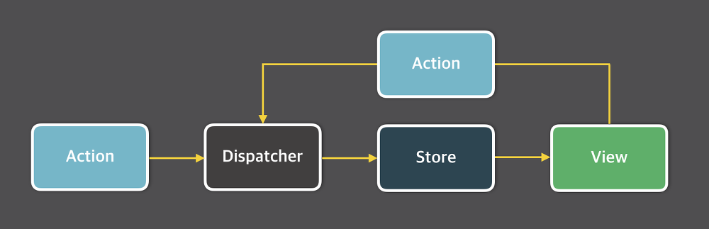

# 1

## 관심사의 분리

Seperation Of Concerns. 소프트웨어 개발의 기본 원칙 중 하나.  
여러 디자인 패턴 및 아키텍쳐는 SoC를 기본적인 원칙으로 삼는다.  

핵심은 프로그램을 작은 조각(모듈)으로 나누고, 각 조각은 구분된 개별 작업을 완료할 수 있게 만드는 것.  
여기서 구분된 개별 작업을 관심사라고 한다.  

관심사를 분리한다. ⇒ 하나의 모듈은 하나의 기능을 담당한다.  
다르게 말하면 어떤 모듈을 수정할 때는 그 모듈이 담당하는 기능의 수정이 있을 때 뿐이다.  
관심사를 분리해 놓으면 혹시나 프로그램에 수정이 필요한 경우 수정 사항이 여러 모듈로 퍼져나가는 케이스를 막아줄 수 있어 유지보수 및 업그레이드 시 용이하다.

## Layered Architecture

소프트웨어 개발에 가장 일반적으로 사용되는 아키텍처.  
구성되는 Layer의 숫자에 따라 N 계층(N-tier) 아키텍처라고 부르기도 한다.

가장 대표적으로는 4-Tier Layered Architecture를 사용한다.

### Presentation Layer

화면에 무언가를 표시하는 것을 주 관심사로 가진다.  
어떤 비즈니스 로직이 수행되는 지는 알 필요가 없고 화면에 어떤 내용을 보여주는지만 알고 있으면 된다.

대표적으로는 View와 Controller가 해당된다.

### Business Layer

비즈니스 로직을 수행하는것을 관심사로 둔다. 마찬가지로 화면에 어떻게 보여지는지, 데이터가 어디서 어떻게 가져오는지는 중요하지 않다.  
단지 Persistance 계층에서 데이터를 가져와서 비즈니스 로직을 수행 후에 결과 데이터를 Presentation 계층으로 전달하는게 관심사이다.

대표적으로 Service, Domain Model이 있다.

### Persistence Layer

애플리케이션 영속성 구현을 위해, 데이터 출처와 데이터 CRUD를 다루는것을 주 관심사로 둔다.

> 영속성이란?  
> 값이나 상태를 별도의 저장소에 기록해서 프로그램이 종료되어도 프로그램의 상태가 유지되도록 하는 것

대표적으로 Repository, DAO 가 있다.

### Database Layer

MariaDB, MySQL 등 실제 데이터베이스가 위치하는 계층을 의미한다.

## Flux Architecture

Meta에서 MVC의 대안으로 발표한 아키텍처.

MVC 패턴 구성은 아래와 같다.

- Model - 데이터와 비즈니스 로직 관리
- View - 레이아웃 및 화면 처리
- Controller - 모델과 뷰로 명령 전달


위 그림 예시처럼 View ↔ Model 간 양방향 데이터 흐름이 존재하기 때문에  
기능이 추가되거나, 프로그램 자체가 거대해지면 복잡성이 매우 커지게 된다.

이에 대한 해결방안으로 Meta는 단방향 데이터 흐름을 택하였다.  
데이터가 단방향으로만 흐르게 하여, 새로운 데이터를 넣으면 처음부터 다시 시작하는 방식의 설계로 이러한 구조를 FLUX 구조라고 불렀다.



FLUX 구조는 아래와 같은 구성요소로 이루어진다.

- Action  
어떤 행위인지와 그 행위로부터 넘겨받은 값을 가지는 객체를 말한다. type과 payload를 가진다.  
기존 상태를 변경하기 위한 액션 생성을 담당하며 해당 액션을 디스패쳐에 넘긴다.
- Dispatcher  
모든 액션을 받아서 적절히 처리한 다음 스토어에게 넘긴다.  
중요한 점은 스토어가 모든 액션을 받는다는 점이다.
- Store  
모든 액션을 받아 필요한 액션을 필터링한다. 이후에 상태값을 변경하고  
자신에게 연결된 View와 Controller에게 상태가 변화되었음을 알린다.
- View  
컴포넌트라고 생각하면 편하다. 변화된 상태에 따라 새로운 데이터로 화면을 리렌더링 한다.  
또한 사용자가 View에 어떤 조작을 하면 그에 해당하는 Action을 생성한다.

[Flux 패턴이란? (velog.io)](https://velog.io/@andy0011/Flux-%ED%8C%A8%ED%84%B4%EC%9D%B4%EB%9E%80)

## useReducer

useState를 대체할 수 있는 함수이다.  

좀 더 복잡한 상태 관리가 필요한 경우 reducer를 사용할 수 있다.  
reducer는 이전 상태와 Action을 합쳐, 새로운 state를 만드는 조작을 말한다.

```jsx
const [state, dispatch] = useReducer(reducer, initialState, init);
```

- state : 컴포넌트가 지닐 새로운 상태
- dispatch 함수 : 첫번째 인자인 reducer 함수를 실행시킴. state 업데이트를 위해 사용되는 함수
- reducer 함수 : 컴포넌트 외부에서 state를 업데이트하는 함수

아래는 버튼을 통해 카운터를 만드는 예시를 reducer로 작성한 예시이다.

```jsx
const initialState = {count: 0};

function reducer(state, action) {
  switch (action.type) {
    case 'increment':
      return {count: state.count + 1};
    case 'decrement':
      return {count: state.count - 1};
    default:
      throw new Error();
  }
}

function Counter() {
  const [state, dispatch] = useReducer(reducer, initialState);
  return (
    <>
      Count: {state.count}
      <button onClick={() => dispatch({type: 'decrement'})}>-</button>
      <button onClick={() => dispatch({type: 'increment'})}>+</button>
    </>
  );
}
```

## useCallback

특정함수를 새로 만들지 않고 재사용하고자 할 때 사용하는 훅이다. 성능최적화를 위해 사용한다.

```jsx
const memoizedCallback = useCallback(
  () => {
    // 함수 내용
  },
  [/* 의존성 배열 */]
);
```

첫 번째 매개변수: 메모이제이션된 함수  
두 번째 매개변수: 의존성배열. 이별에 포함된 값들 중 하나라도 변경되면 새롭게 함수 생성  

## External Store

여기서 External 이라는 뜻은 리액트 바깥이라는 의미이다.  
리액트가 관리하지 않는다는 의미
