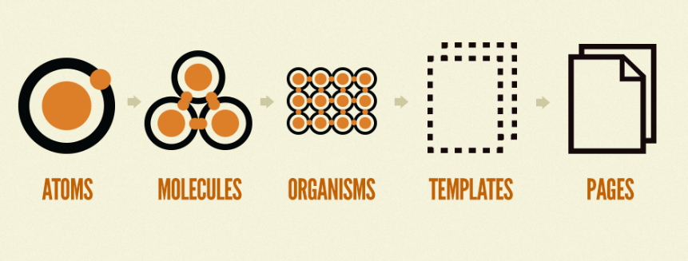

# 1

## 반응형 웹 디자인(Responsive web design)

하나의 웹 페이지가 모든 화면 크기와 해상도에서 잘 렌더링 되도록 하고  
사용성도 보장하는 웹 디자인 접근 방식이다. 기본적으로 멀티 디바이스를 위한 디자인 방식

2023년 현재 기준, 전세계 스마트폰 사용자 수는 55억명을 돌파했으며 온라인 검색 70% 이상이 모바일 기기에서 발생하고 있다.  
여러 플랫폼에서 원활하게 동작하고 디자인을 잘 보여줄 수 있는 웹사이트 제작이 더욱 중요하다.

하나의 웹 사이트로 다양한 디바이스에 대응할 수 있으므로 유지보수 및 추가적인 개발 이슈에서 시간과 비용측면에서 더욱 효율적이다.

### 적응형 웹 디자인

브라우저가 주어진 플랫폼에 맞춰 특별히 생성된 레이아웃을 불러오는 웹 디자인 방식

## 디자인 시스템(Design System)

> 디자인 시스템은 다양한 페이지와 채널을 걸쳐 공통의 언어와 시각적 일관성을 만들고  
> 반복되는 작업을 줄임으로써, 규모에 맞게 디자인을 관리하기 위한 표준 집합이다.  
> Nielsen Norman Group

웹이나 서비스 디자인에 적용된 디자인 스타일의 규칙 혹은 가이드라인.  
공통으로 사용된 컬러, 레이아웃, UI 등의 대한 정의라고 볼 수 있다.

디자인 시스템을 정의하고 정확하게 사용함으로써 서비스 전체적인 디자인을 일관되게 유지하고, 작업을 효율적으로 진행할 수 있다.  
Single Source Of Truth에 비유하여 디자인 시스템을 설명하기도 한다.

가장 대표적인 예시로는 구글의 Material Design 이 있다.

## Atomic Design

화학적?관점에서 영감을 받은 디자인 시스템 방법론 이다.  
UI를 물질의 가장 작은 단위인 원자(Atom)처럼 최대한 작게 쪼개고,  
그것들을 조합하여 다른 구성 요소를 만들어내는 디자인 시스템을 목표로 한다.

  

아토믹 디자인은 원자 ⇒ 분자 ⇒ 유기체 ⇒ 템플릿 ⇒ 페이지 단계로 구성된다.

### 원자 (atoms)

가장 작은 단위의 컴포넌트. 디자인 혹은 기능적인 최소 단위를 말한다.  
대표적으로 버튼, Input, 라벨 등이 있다.

### 분자 (molecules)

2개 이상의 원자로 이루어진다. 하나의 단위로 함께 동작하는 단순한 컴포넌트 그룹  
대표적으로 Input Form (Button, Input, Label 등의 결합)

### 유기체 (organisms)

여러개의 분자혹은 원자가 결합된 형태. UI가 어떻게 보이는지 시작하는 단계이다.  
Input Form을 포함한 헤더, 혹은 여러개의 Card로 이루어진 그리드 등이 예시이다.

### 템플릿 (templates)

여러 유기체의 결합체. 디자인을 확인하고 레이아웃을 구성하는 단계

### 페이지 (page)

템플릿을 사용한 완성된 하나의 페이지
