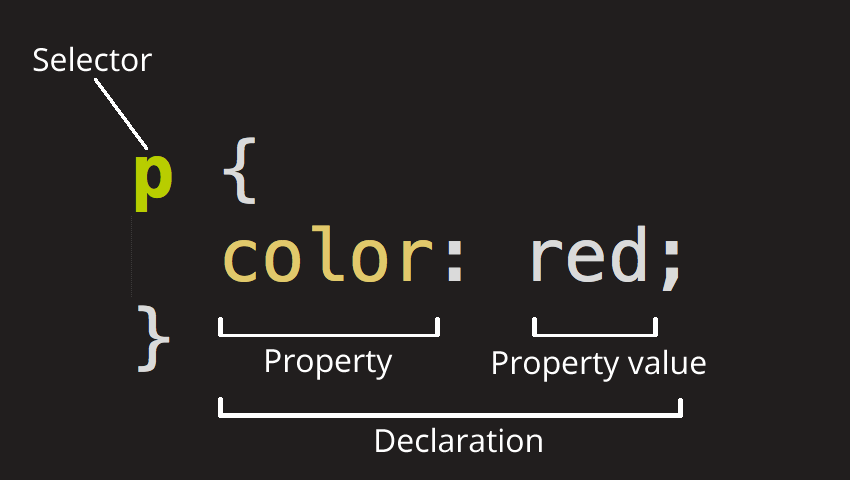

# 3

## CSS in JS

단어 그대로 자바스크립트 코드에서 CSS를 작성하는 방식을 말한다.  
2014년 페이스북 개발자인 Christopher Chedeau aka Vjeux가 처음 소개하였다.  

가장 큰 장점 중 하나로는 컴포넌트 기반의 스타일링을 다룰 수 있는 기능이다.  
CSS in JS는 스타일을 컴포넌트에 직접 연결하여 스타일 관리가 용이하다.

## CSS

Cascading Style Sheets의 약자로. 웹페이지를 꾸미기 위해 작성하는 코드이다.  

CSS은 프로그래밍언어, 혹은 마크업 언어가 아니다. 단지 Style Sheet 이다.  
html 문서에 있는 요소들에 선택적으로 스타일을 적용하기 위해서 사용한다.  

