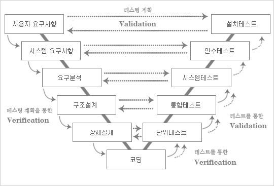

# Unit Test

## V-model

  
테스트관련하여 자주 언급되는 프로그램 개발 프로세스이다. 폭포수 모델을 확장한 개념이다.

V 모델은 각 단계에 대한 필요한 테스트를 나누고, 처음부터 어떻게 테스트해야 하는지 결정하려고 노력한다.  
테스트 설계를 프로그램을 모두 완성하고 하는게 아니라 프로그램 설계 시작 할 때 부터 같이 고려한다.

### 테스트 유형

1. 단위 테스트  
   구현 단계에서 개발자가 직접 진행하는 테스트이다.  
   프로그램의 클래스 혹은 메서드 단위 테스트이다.
2. 통합 테스트  
   클래스 혹은 모듈단위로 결합하여 전체적인 흐름을 테스트하는 단계이다.
3. 시스템 테스트  
   통합된 시스템에 대해 비 기능적인 테스트를 진행하는 단계이다.
4. 인수 테스트  
   고객이 프로그램을 인수받아 원하는대로 동작하는지 확인하는 테스트이다.
5. 설치 테스트  
   완성된 프로그램을 설치하면서 주변 하드웨어와 잘 연동 되는지 등을 테스트한다.

> 개발자 테스트 라는 영역도 있다.  
> 미리 계획하여 할 수 있는 영역의 테스트를 말한다.  
> 프로그램을 완성하고 공개하면 개발 과정 중에서 미처 생각못한 케이스의  
> 에러나 버그들이 발생하는것은 자연스러운 일이다.  
> 그런거는 일단 놔두고, 개발 과정중에 눈에 보이고 생각하고 대처 할 수 있는 상황에 대해서는  
> 미리 테스트 하여 대비할 수 있다.

## 코드 품질

일단 품질이란 크게 내부 품질과 외부 품질이 있다.

### 외부 품질

외부에서 보는 관점, 직접 사용해 보았을 때 프로그램이 잘 동작하는가? 버그가 없는가?  
그냥 눈에 보이기에 잘 동작하는가?를 나타내는 개념이다.

### 내부 품질

프로그램이 동작은 잘 하지만 내부 코드 상태가 얼마나 좋은지를 나타내는 개념이다.  
동작은 잘 하지만 내부에는 스파게티 코드처럼 복잡하게 구성되어있을 수도 있다.  
내적 품질은 당장 성과가 크게 나지는 않는다. 내적 품질이 좋지 않으면 언제 잘못되어도 이상하지 않다.

내부 품질이 굳이 좋아야 하는 이유는 무엇일까?  
당장 사용자 입장에서 내부 품질이 좋아야 할 이유는 없다. 사용자 입장에서는 일단 동작만 하면 되기 때문이다.  
그러나 내부 품질이 좋아야 나중에 문제 혹은 버그가 생겼을 때 빠르게 대응하고,  
유지보수 혹은 수정, 업데이트 하기가 쉽다. 즉 내부 품질이 좋아야 장기적으로 사용자에게도 이득이다.

## JUnit 5 (Unit test)

JUnit은 정확히는 자동화된 테스트를 위한 도구다.  
이름에 Unit이 들어가지만 단위테스트만 하는건 아니며, JUnit을 통해 통합테스트도 가능하다.

JUnit은 어노테이션을 통해 쉽게 테스트 코드를 작성할 수 있도록 지원한다.  
assert 메서드를 통해 어떤 테스트의 결과가 올바른지 판단 할 수 있다.

### 단위 테스트란?

공학이라는 큰 관점에서 단위라는 단어에서 어딘가에서 사용하는 '부품'이라는 의미를 바라볼 수 있다.  
그렇다면 이번에는 부품이라는 관점에서 2가지 중요 포인트가 있다.

1. 믿고 쓸 수 있는 부품인가?
2. 믿고 쓸 수 있다면 그 부품으로 무엇을 만들 수 있는가?

믿고 쓸 수 있는 부품인지 테스트 하는 과정이 바로 단위 테스트이다.  
각 클래스 혹은 메서드 단위로 믿을만한 동작을 하는지에 대한 테스트를 작성한다.

그리고 믿고 사용할 수 있는 부품들로 더 큰 무언가를 만들 수 있다.  
믿을만한 부품으로 만들어진 더 큰 단위들도 믿을 수 있기 때문이다.  
이렇게 큰 단위를 테스트 하는 것이 통합테스트 라고 할 수 있다.

### 테스트 피라미드

    Unit Test - Integration Test - E2E Test

Unit Test는 위에서 설명한 것 처럼 가장 작은 범위의 테스트 이다.  
프로그램에서 작성한 클래스, 메서드 단위를 테스트 한다.

Integration Test, 통합 테스트는 좀 더 큰 단위의 테스트이다.  
프로그램의 어떤 기능에 대한 전체적인 동작 여부를 테스트 한다.

E2E Test, 종단 테스트는 사용자 입장에서 진행하는 테스트이다.  
GUI를 통한 실제 기능 테스트, DB와 연결하여 하는 테스트 등  
실제로 사용자가 사용한다는 가정으로 진행하는 테스트이다.

왼쪽 방향으로 갈수록 사용자의 입장에 더 가까운 테스트이다.  
그러나 가장 뿌리가 되는 것은 Unit Test이다.  
Unit Test가 믿을 만하면 그 위에 테스트도 믿을 만하고 결국 프로그램에 대한 신뢰성이 올라간다.
