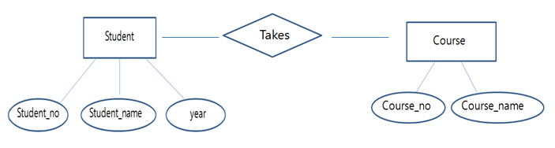

# Relational Model

## 관계형 모델

이전에 짧게 정리했던 것 처럼 관계형 모델은 가장 일반적으로 사용되는  
데이터 모델의 한 종류 이다.

관계형 모델은 2차원 구조의 테이블 형태로 데이터를 표현하는 방식을 말한다.  
관계형 모델은 3가지 요소로 구성된다.

## 1. Attribute

어떤 데이터가 가지는 속성을 의미한다.  
속성은 이름과 타입으로 구성된다. 마치 자바에서 쓰는 변수와 같다  
속성의 이름은 해당 집합안에서 유일해야 한다.

예를 들어 '사람' 이라는 개념을 데이터로 표현하면  
문자열로 표현하는 '이름'과 정수로 표현하는 '나이'를 속성을 가진다고 생각할 수 있다.

보통 DB에서 생각하는 column과 같은 개념이라고 생각해도 무방할듯 하다.

## 2. Tuple

(속성, 값) 쌍의 집합이다. 실제 데이터 객체 하나 라고 생각해도 좋다.  
위에서 말한 '사람'이라는 개념의 데이터 표현에서  
(이름:홍길동 / 나이:28세) 와 같은 하나의 데이터 객체가 하나의 튜플이다.  
하나의 집합에서 속성 이름은 겹치지 않는다.

보통 DB에서 Row 혹은 Record로 구현된다.

대부분의 RDBMS에서는 기본적으로는 중복과 null(정보의 부재)도 허용한다.  
그렇기 때문에 `not null` 같은 옵션을 따로 처리해주어야 한다.

## 3. Relation

관계; (속성의 집합, 튜플의 집합) 의 쌍을 의미한다.  
더 쉽게 생각하면 튜플의 집합이라고 생각해도 좋다.

보통 DB에서 데이터 테이블이라고 생각해도 무방하다.

---

## 참고사항

ERM; Entity Relationship Model 에서의 Relationship과  
RM; Relational Model 에서의 Relation의 차이는 무엇일까?

### Entity Relationship Model

일단 ERM은 설계한 데이터 모델을 개체, 속성, 관계로 구분하여 정리하는 것을 의미한다.

학생과 수업 이라는 개체가 있고, 각 개체는 고유한 속성을 가진다.  
학습은 학번, 이름, 학년 이라는 속성을 가지며,  
수업은 수업 번호, 수업 이름이라는 속성을 가진다.  
그리고 두 개체 사이에는 학생이 수업을 '수강한다'라는 관계를 가진다.

이처럼 ERM의 Relationship은 개체사이의 '관계'를 의미한다.  
RM의 Relation은 Tuple의 집합, 더 일반적인 용어로 표현하면 데이터 테이블을 의미한다.

둘은 사실 아무 상관 없는 용어다. 구분 잘하기…!
